# Knowlex 桌面智能助理 - 技术设计文档

## 概述

Knowlex 是一款基于 Electron + React 的跨平台桌面智能助理应用，集成了对话式 AI、项目管理、文件处理和个性化知识记忆功能。本文档详细描述了应用的技术架构、组件设计和实现方案。

## 技术栈

### 核心技术

- **前端框架**: React 18 + TypeScript
- **桌面框架**: Electron (最新稳定版)
- **AI SDK**: OpenAI Agents JS SDK
- **数据库**: SQLite (元数据) + hnswsqlite (向量存储)
- **UI 组件库**: Chakra UI
- **状态管理**: Zustand
- **样式方案**: Tailwind CSS + Chakra UI

### 开发工具

- **构建工具**: Vite
- **代码规范**: ESLint + Prettier
- **类型检查**: TypeScript
- **测试框架**: Jest + React Testing Library
- **打包工具**: Electron Builder
- **Monorepo 管理**: pnpm workspace
- **共享类型包**: @knowlex/types (内部包)

### 契约版本化

- **IPC 通道版本**: 采用 semver 标签 (v1.0.0, v1.1.0)
- **数据库 Schema 版本**: 版本字段 + 迁移脚本
- **API 接口版本**: 版本化的类型定义和 changelog
- **变更管理**: 自动生成 changelog，接口演进可追溯

## 系统架构

### 整体架构图


### 进程架构

#### Main Process (Node.js)

- **职责**: 窗口管理、数据库操作、文件系统访问、系统级功能、Worker 进程管理
- **核心模块**:
  - `WindowManager`: 管理应用窗口
  - `DatabaseManager`: SQLite 和 hnswsqlite 操作
  - `FileManager`: 文件上传、转换、存储（轻量级操作）
  - `WorkerManager`: 管理 Worker 线程（重型文件处理和向量化）
  - `IPCHandler`: 进程间通信处理

#### Worker Threads (Node.js)

- **职责**: 重型文件处理、PDF 转换、向量化计算
- **核心模块**:
  - `FileProcessor`: 大文件处理和 PDF/A 转换
  - `EmbeddingProcessor`: 文本向量化处理
  - `TaskQueue`: 任务队列管理

#### Renderer Process (React)

- **职责**: 用户界面、用户交互、状态管理
- **核心模块**:
  - `UIComponents`: React 组件
  - `StateStore`: Zustand 状态管理
  - `APIService`: OpenAI Agents JS 集成
  - `IPCClient`: 与主进程通信

## 数据模型设计

### SQLite 数据库结构

```sql
-- 项目表
CREATE TABLE projects (
    id INTEGER PRIMARY KEY AUTOINCREMENT,
    name TEXT NOT NULL UNIQUE,
    created_at DATETIME DEFAULT CURRENT_TIMESTAMP,
    updated_at DATETIME DEFAULT CURRENT_TIMESTAMP
);

-- 会话表
CREATE TABLE conversations (
    id INTEGER PRIMARY KEY AUTOINCREMENT,
    title TEXT NOT NULL DEFAULT 'Untitled Chat',
    project_id INTEGER,
    created_at DATETIME DEFAULT CURRENT_TIMESTAMP,
    updated_at DATETIME DEFAULT CURRENT_TIMESTAMP,
    FOREIGN KEY (project_id) REFERENCES projects(id) ON DELETE SET NULL
);

-- 消息表
CREATE TABLE messages (
    id INTEGER PRIMARY KEY AUTOINCREMENT,
    conversation_id INTEGER NOT NULL,
    role TEXT NOT NULL CHECK (role IN ('user', 'assistant', 'system', 'tool')),
    content TEXT NOT NULL,
    file_references TEXT, -- JSON 数组存储文件引用 ID
    tool_calls TEXT, -- JSON 格式存储工具调用信息
    metadata TEXT, -- JSON 格式存储其他元数据
    created_at DATETIME DEFAULT CURRENT_TIMESTAMP,
    FOREIGN KEY (conversation_id) REFERENCES conversations(id) ON DELETE CASCADE
);

-- 文件表
CREATE TABLE files (
    id INTEGER PRIMARY KEY AUTOINCREMENT,
    project_id INTEGER NOT NULL,
    filename TEXT NOT NULL,
    original_path TEXT NOT NULL,
    pdf_path TEXT NOT NULL,
    file_size INTEGER NOT NULL,
    md5_original TEXT NOT NULL,
    md5_pdf TEXT NOT NULL,
    status TEXT NOT NULL DEFAULT 'processing' CHECK (status IN ('processing', 'completed', 'failed')),
    created_at DATETIME DEFAULT CURRENT_TIMESTAMP,
    FOREIGN KEY (project_id) REFERENCES projects(id) ON DELETE CASCADE
);

-- 项目记忆表
CREATE TABLE project_memories (
    id INTEGER PRIMARY KEY AUTOINCREMENT,
    project_id INTEGER NOT NULL,
    content TEXT NOT NULL,
    type TEXT NOT NULL DEFAULT 'memory' CHECK (type IN ('memory', 'description')),
    is_system BOOLEAN DEFAULT FALSE, -- 系统生成的记忆（如项目描述）不可删除
    created_at DATETIME DEFAULT CURRENT_TIMESTAMP,
    FOREIGN KEY (project_id) REFERENCES projects(id) ON DELETE CASCADE
);

-- 项目知识表
CREATE TABLE project_knowledge (
    id INTEGER PRIMARY KEY AUTOINCREMENT,
    project_id INTEGER NOT NULL,
    title TEXT NOT NULL,
    content TEXT NOT NULL,
    created_at DATETIME DEFAULT CURRENT_TIMESTAMP,
    updated_at DATETIME DEFAULT CURRENT_TIMESTAMP,
    FOREIGN KEY (project_id) REFERENCES projects(id) ON DELETE CASCADE
);

-- 应用设置表
CREATE TABLE app_settings (
    key TEXT PRIMARY KEY,
    value TEXT NOT NULL,
    updated_at DATETIME DEFAULT CURRENT_TIMESTAMP
);

-- 向量存储表（使用 hnswsqlite）
CREATE VIRTUAL TABLE IF NOT EXISTS vector_documents USING hnsw(
    id TEXT PRIMARY KEY,
    file_id INTEGER,
    project_id INTEGER,
    chunk_index INTEGER,
    content TEXT,
    filename TEXT,
    chunk_start INTEGER,
    chunk_end INTEGER,
    created_at TEXT,
    embedding(768) -- 向量维度，根据实际 embedding 模型调整
);

-- 重排模型配置
CREATE TABLE rerank_settings (
    id INTEGER PRIMARY KEY AUTOINCREMENT,
    model_name TEXT NOT NULL,
    api_key TEXT,
    base_url TEXT,
    enabled BOOLEAN DEFAULT FALSE,
    created_at DATETIME DEFAULT CURRENT_TIMESTAMP
);

-- 创建索引
CREATE INDEX idx_conversations_project_id ON conversations(project_id);
CREATE INDEX idx_messages_conversation_id ON messages(conversation_id);
CREATE INDEX idx_files_project_id ON files(project_id);
CREATE INDEX idx_project_memories_project_id ON project_memories(project_id);
CREATE INDEX idx_project_knowledge_project_id ON project_knowledge(project_id);
```

### hnswsqlite 向量存储结构

```typescript
interface VectorDocument {
  id: string // 唯一标识符
  file_id: number // 关联的文件 ID
  project_id: number // 关联的项目 ID
  chunk_index: number // 文本块索引
  content: string // 原始文本内容
  filename: string // 文件名
  chunk_start: number // 文本块开始位置
  chunk_end: number // 文本块结束位置
  created_at: string // 创建时间
  embedding: number[] // 向量表示（由 hnswsqlite 处理）
}

interface RerankResult {
  document: VectorDocument
  score: number
  relevance_score: number // 重排后的相关性分数
}
```

## 组件架构设计

### 前端组件层次结构

```
src/
├── components/
│   ├── layout/
│   │   ├── Sidebar.tsx           # 左侧边栏
│   │   ├── MainContent.tsx       # 右侧主内容区
│   │   └── Layout.tsx            # 整体布局
│   ├── chat/
│   │   ├── ChatInterface.tsx     # 聊天界面
│   │   ├── MessageList.tsx       # 消息列表
│   │   ├── MessageInput.tsx      # 消息输入框
│   │   └── FileUpload.tsx        # 文件上传组件
│   ├── project/
│   │   ├── ProjectList.tsx       # 项目列表
│   │   ├── ProjectOverview.tsx   # 项目概览
│   │   ├── FileManager.tsx       # 文件管理
│   │   └── MemoryKnowledge.tsx   # 记忆与知识管理
│   ├── search/
│   │   ├── GlobalSearch.tsx      # 全局搜索
│   │   └── SearchResults.tsx     # 搜索结果
│   ├── settings/
│   │   ├── SettingsPanel.tsx     # 设置面板
│   │   ├── APIConfig.tsx         # API 配置
│   │   └── ThemeSelector.tsx     # 主题选择器
│   └── common/
│       ├── Modal.tsx             # 通用模态框
│       ├── Button.tsx            # 通用按钮
│       └── Loading.tsx           # 加载组件
├── services/
│   ├── api/
│   │   ├── openai.service.ts     # OpenAI API 服务
│   │   ├── embedding.service.ts  # 向量化服务
│   │   └── ipc.service.ts        # IPC 通信服务
│   ├── database/
│   │   ├── sqlite.service.ts     # SQLite 操作
│   │   └── vector.service.ts     # 向量数据库操作
│   ├── file/
│   │   └── file.service.ts       # 文件处理服务
│   └── mock/
│       ├── ipc.mock.ts           # IPC Mock 服务
│       ├── openai.mock.ts        # OpenAI Mock 服务
│       └── database.mock.ts      # 数据库 Mock 服务
├── stores/
│   ├── app.store.ts              # 应用全局状态
│   ├── chat.store.ts             # 聊天状态
│   ├── project.store.ts          # 项目状态
│   └── settings.store.ts         # 设置状态
├── types/
│   ├── api.types.ts              # API 类型定义 (引用 @knowlex/types)
│   ├── database.types.ts         # 数据库类型定义 (引用 @knowlex/types)
│   └── app.types.ts              # 应用类型定义
├── utils/
│   ├── constants.ts              # 常量定义
│   ├── helpers.ts                # 工具函数
│   └── validation.ts             # 数据验证
└── i18n/
    ├── index.ts                  # 国际化配置
    ├── locales/
    │   ├── en.json              # 英文语言包
    │   └── zh.json              # 中文语言包
    └── hooks/
        └── useTranslation.ts     # 翻译 Hook
```

### 共享类型包结构

```
packages/
└── types/
    ├── package.json              # @knowlex/types 包配置
    ├── src/
    │   ├── ipc.types.ts          # IPC 通道类型定义
    │   ├── database.types.ts     # 数据库 Schema 类型
    │   ├── api.types.ts          # API 接口类型
    │   ├── common.types.ts       # 通用类型定义
    │   └── index.ts              # 类型导出入口
    ├── CHANGELOG.md              # 类型变更日志
    └── README.md                 # 类型包文档
```

### 后端服务层次结构

```
src-electron/
├── main/
│   ├── index.ts                  # 主进程入口
│   ├── window.ts                 # 窗口管理
│   └── menu.ts                   # 菜单配置
├── services/
│   ├── database/
│   │   ├── sqlite.manager.ts     # SQLite 管理器
│   │   ├── vector.manager.ts     # hnswsqlite 管理器
│   │   ├── migration.ts          # 数据库迁移
│   │   └── schema.version.ts     # Schema 版本管理
│   ├── file/
│   │   ├── file.manager.ts       # 文件管理器
│   │   ├── pdf.converter.ts      # PDF 转换器
│   │   └── storage.manager.ts    # 存储管理器
│   ├── ai/
│   │   ├── openai.client.ts      # OpenAI 客户端
│   │   ├── embedding.client.ts   # 向量化客户端
│   │   ├── rerank.client.ts      # 重排模型客户端
│   │   └── rag.service.ts        # RAG 服务
│   └── search/
│       └── fulltext.service.ts   # 全文搜索服务
├── handlers/
│   ├── base.handler.ts           # 基础处理器 (版本化支持)
│   ├── chat.handler.ts           # 聊天处理器
│   ├── project.handler.ts        # 项目处理器
│   ├── file.handler.ts           # 文件处理器
│   └── settings.handler.ts       # 设置处理器
├── workers/
│   ├── file-processor.worker.ts  # 文件处理 Worker Thread
│   ├── embedding.worker.ts       # 向量化 Worker Thread
│   └── task-queue.worker.ts      # 任务队列 Worker Thread
├── types/
│   ├── ipc.types.ts              # IPC 类型定义 (引用 @knowlex/types)
│   ├── database.types.ts         # 数据库类型定义 (引用 @knowlex/types)
│   └── worker.types.ts           # Worker 线程类型定义
└── utils/
    ├── logger.ts                 # 日志工具
    ├── crypto.ts                 # 加密工具
    ├── path.helper.ts            # 路径工具
    └── version.helper.ts         # 版本管理工具
```

## 页面原型设计

### 1. 主界面：新建聊天 / 未归类聊天 (Home / New Chat / Uncategorized Chat)


这是应用启动或点击“+ New Chat”时显示的初始界面。左侧为固定宽度导航栏，右侧为主内容区。

```
+-------------------------------------------------------------------------------------------------+
| Knowlex                                                                                         |
|-------------------------------------------------------------------------------------------------|
| +--------------------------------+ +------------------------------------------------------------+
| | 左侧边栏 (260px)               | | 主内容区 (自适应宽度)                                        |
| |--------------------------------| |------------------------------------------------------------|
| | [Knowlex Logo]                 | |                                                            |
| |                                | |                                                            |
| | + New Chat (始终置顶)          | |                                                            |
| |                                | |                                                            |
| | [🔍 Global Search Icon]         | |                                                            |
| |                                | |                                                            |
| | > Projects (+)                 | |                                                            |
| |   - Project A                  | |                                                            |
| |   - Project B                  | |                                                            |
| |                                | |                                                            |
| | > Chats (未归类聊天)           | |                                                            |
| |   - Untitled Chat (当前会话)   | |                                                            |
| |   - Chat 历史 1                | |                                                            |
| |   - Chat 历史 2                | |                                                            |
| |                                | |                                                            |
| |                                | |         "你好，有什么可以帮你的吗？"                       |
| | [👤 用户头像] [用户名]         | |         "可以上传 TXT 或 MD 文件开始。"                   |
| | [⚙️ 设置图标]                  | |                                                            |
| +--------------------------------+ |                                                            |
|                                  | |                                                            |
|                                  | |                                                            |
|                                  | | +--------------------------------------------------------+ |
|                                  | | | [📎 文件上传图标] 输入消息...                          | |
|                                  | | |                                     [➡️ 发送按钮]      | |
|                                  | | +--------------------------------------------------------+ |
|                                  +------------------------------------------------------------+
+-------------------------------------------------------------------------------------------------+
```


### 2. 全局搜索模态框 (Global Search Modal)


点击左侧边栏的“全局搜索”图标时弹出的居中模态框。

```
+-------------------------------------------------------------------------------------------------+
| Knowlex                                                                                         |
|-------------------------------------------------------------------------------------------------|
| +--------------------------------+ +------------------------------------------------------------+
| | 左侧边栏                       | | 主内容区                                                   |
| |--------------------------------| |------------------------------------------------------------|
| | ...                            | |                                                            |
| |                                | |                                                            |
| |                                | |        +----------------------------------------+          |
| |                                | |        |            全局搜索                  [X]|          |
| |                                | |        |----------------------------------------|          |
| |                                | |        | [🔍] 搜索关键词...                       |          |
| |                                | |        |----------------------------------------|          |
| |                                | |        |                                        |          |
| |                                | |        | 会话标题 1                               |          |
| |                                | |        |   - 包含[关键词]的上下文摘要...          |          |
| |                                | |        |   - 所属项目: Project A                  |          |
| |                                | |        |----------------------------------------|          |
| |                                | |        | 会话标题 2                               |          |
| |                                | |        |   - 包含[关键词]的上下文摘要...          |          |
| |                                | |        |   - 所属项目: (未归类)                   |          |
| |                                | |        |----------------------------------------|          |
| |                                | |        | ... (按更新时间倒序，无限滚动)         |          |
| |                                | |        +----------------------------------------+          |
| | ...                            | |                                                            |
| +--------------------------------+ +------------------------------------------------------------+
+-------------------------------------------------------------------------------------------------+
```


### 3. 新建项目模态框 (New Project Modal)


点击左侧边栏“Projects”旁边的“+”按钮时弹出的模态框。

```
+-------------------------------------------------------------------------------------------------+
| Knowlex                                                                                         |
|-------------------------------------------------------------------------------------------------|
| +--------------------------------+ +------------------------------------------------------------+
| | 左侧边栏                       | | 主内容区                                                   |
| |--------------------------------| |------------------------------------------------------------|
| | ...                            | |                                                            |
| |                                | |                                                            |
| |                                | |        +----------------------------------------+          |
| |                                | |        |            新建项目                  [X]|          |
| |                                | |        |----------------------------------------|          |
| |                                | |        | 项目名称:                               |          |
| |                                | |        | [_____________________________________] |          |
| |                                | |        |                                        |          |
| |                                | |        | 项目描述 (可选):                         |          |
| |                                | |        | [_____________________________________] |          |
| |                                | |        | (最多200字符，禁止换行)                |          |
| |                                | |        |                                        |          |
| |                                | |        |                                        |          |
| |                                | |        |            [取消]    [创建]            |          |
| |                                | |        +----------------------------------------+          |
| | ...                            | |                                                            |
| +--------------------------------+ +------------------------------------------------------------+
+-------------------------------------------------------------------------------------------------+
```


### 4. 项目概览页 (Project Overview Page)


点击左侧边栏中的项目名称时显示此页面。

```
+-------------------------------------------------------------------------------------------------+
| Knowlex                                                                                         |
|-------------------------------------------------------------------------------------------------|
| +--------------------------------+ +------------------------------------------------------------+
| | 左侧边栏                       | | 主内容区                                                   |
| |--------------------------------| |------------------------------------------------------------|
| | [Knowlex Logo]                 | |                                                            |
| |                                | |                                                            |
| | + New Chat                     | |                                                            |
| |                                | |                                                            |
| | [🔍 Global Search Icon]         | |                                                            |
| |                                | |                                                            |
| | > Projects (+)                 | |                                                            |
| |   - Project A (当前选中)       | |                                                            |
| |     - Chat 1                   | |                                                            |
| |     - Chat 2                   | |                                                            |
| |   - Project B                  | |                                                            |
| |                                | |                                                            |
| | > Chats                        | |                                                            |
| |   - Chat 历史 3                | |                                                            |
| |                                | |                                                            |
| |                                | |                 [Project A]                                |
| | [👤 用户头像] [用户名]         | |                 (项目概览)                                 |
| | [⚙️ 设置图标]                  | |                                                            |
| +--------------------------------+ |                                                            |
|                                  | |                                                            |
|                                  | | +--------------------------------------------------------+ |
|                                  | | | [📎 文件上传图标] 输入消息...                          | |
|                                  | | | (新会话将自动归入 Project A)                           | |
|                                  | | |                                     [➡️ 发送按钮]      | |
|                                  | | +--------------------------------------------------------+ |
|                                  | |                                                            |
|                                  | | +---------------------+   +---------------------+        |
|                                  | | |    [项目文件]       |   |   [记忆与知识]      |        |
|                                  | | +---------------------+   +---------------------+        |
|                                  +------------------------------------------------------------+
+-------------------------------------------------------------------------------------------------+
```


### 5. 项目聊天页 (Project Chat Page)


点击项目下的某个会话时显示此页面。包含 RAG 引用和“存为知识”悬浮按钮提示。

```
+-------------------------------------------------------------------------------------------------+
| Knowlex                                                                                         |
|-------------------------------------------------------------------------------------------------|
| +--------------------------------+ +------------------------------------------------------------+
| | 左侧边栏                       | | 主内容区                                                   |
| |--------------------------------| |------------------------------------------------------------|
| | [Knowlex Logo]                 | |                                                            |
| |                                | |                                                            |
| | + New Chat                     | |                                                            |
| |                                | |                                                            |
| | [🔍 Global Search Icon]         | |                                                            |
| |                                | |                                                            |
| | > Projects (+)                 | |                                                            |
| |   - Project A (当前选中)       | |                                                            |
| |     - Chat 1 (当前会话)        | |                                                            |
| |     - Chat 2                   | |                                                            |
| |   - Project B                  | |                                                            |
| |                                | |                                                            |
| | > Chats                        | |                                                            |
| |   - Chat 历史 3                | |                                                            |
| |                                | |                                                            |
| |                                | |                 [Chat 1 标题]                              |
| | [👤 用户头像] [用户名]         | |                                                            |
| | [⚙️ 设置图标]                  | |                                                            |
| +--------------------------------+ |                                                            |
|                                  | |   用户: 这是一个关于人工智能的问题。                       |
|                                  | |                                                            |
|                                  | |   AI: 人工智能是...                                        |
|                                  | |       (当用户选择文字时，右上角浮现 "[存为知识] 💡")     |
|                                  | |                                                            |
|                                  | |   引用: [文件 A.txt] [文件 B.md]                           |
|                                  | |                                                            |
|                                  | | +--------------------------------------------------------+ |
|                                  | | | [📎 文件上传图标] 输入消息...                          | |
|                                  | | |                                     [➡️ 发送按钮]      | |
|                                  | | +--------------------------------------------------------+ |
|                                  +------------------------------------------------------------+
+-------------------------------------------------------------------------------------------------+
```


### 6. 项目文件管理页 (Project File Management Page)


点击项目列表中的文件管理图标或项目概览页的“项目文件”按钮时显示。

```
+-------------------------------------------------------------------------------------------------+
| Knowlex                                                                                         |
|-------------------------------------------------------------------------------------------------|
| +--------------------------------+ +------------------------------------------------------------+
| | 左侧边栏                       | | 主内容区                                                   |
| |--------------------------------| |------------------------------------------------------------|
| | [Knowlex Logo]                 | |                                                            |
| |                                | |                                                            |
| | + New Chat                     | |                                                            |
| |                                | |                                                            |
| | [🔍 Global Search Icon]         | |                                                            |
| |                                | |                                                            |
| | > Projects (+)                 | |                                                            |
| |   - Project A (当前选中)       | |                                                            |
| |     - Chat 1                   | |                                                            |
| |     - Chat 2                   | |                                                            |
| |   - Project B                  | |                                                            |
| |                                | |                                                            |
| | > Chats                        | |                                                            |
| |   - Chat 历史 3                | |                                                            |
| |                                | |                                                            |
| |                                | |                 [Project A]                                |
| | [👤 用户头像] [用户名]         | |                 (文件管理)                                 |
| | [⚙️ 设置图标]                  | |                                                            |
| +--------------------------------+ |                                                            |
|                                  | |                                        [⬆️ 导入文件]       |
|                                  | |                                                            |
|                                  | | +-------------------+  +-------------------+               |
|                                  | | | [文件缩略图]      |  | [文件缩略图]      |               |
|                                  | | | 文件名 A.txt      |  | 文件名 B.md       |               |
|                                  | | | 创建时间: YYYY-MM-DD|  | 创建时间: YYYY-MM-DD|               |
|                                  | | | 向量化状态: 成功  |  | 向量化状态: 进行中..|               |
|                                  | | +-------------------+  +-------------------+               |
|                                  | |                                                            |
|                                  | | +-------------------+                                      |
|                                  | | | [文件缩略图]      |                                      |
|                                  | | | 文件名 C.txt      |                                      |
|                                  | | | 创建时间: YYYY-MM-DD|                                      |
|                                  | | | 向量化状态: 失败  |                                      |
|                                  | | +-------------------+                                      |
|                                  +------------------------------------------------------------+
+-------------------------------------------------------------------------------------------------+
```


### 7. 文件预览/编辑模态框 (File Preview/Edit Modal)


此模态框现在明确显示左侧的“内容”和“元数据”标签页，以及右侧的 PDF/A 预览。

```
+-------------------------------------------------------------------------------------------------+
| Knowlex                                                                                         |
|-------------------------------------------------------------------------------------------------|
| +--------------------------------+ +------------------------------------------------------------+
| | 左侧边栏                       | | 主内容区                                                   |
| |--------------------------------| |------------------------------------------------------------|
| | ...                            | |                                                            |
| |                                | |                                                            |
| |                                | |        +----------------------------------------+          |
| |                                | |        |            文件预览/编辑             [X]|          |
| |                                | |        |----------------------------------------|          |
| |                                | |        | [内容] | [元数据]                      |          |
| |                                | |        |----------------------------------------|          |
| |                                | |        |                                        |          |
| |                                | |        | +-------------------+ +----------------+          |
| |                                | |        | | (左侧栏)          | | (右侧栏)       |          |
| |                                | |        | |                   | |                |          |
| |                                | |        | | **[内容 Tab 选中]** | | **PDF/A 预览** |          |
| |                                | |        | | 可编辑的文本内容框 | | (只读)         |          |
| |                                | |        | |                   | |                |          |
| |                                | |        | |                   | |                |          |
| |                                | |        | |                   | |                |          |
| |                                | |        | |                   | |                |          |
| |                                | |        | +-------------------+ +----------------+          |
| |                                | |        |                                        |          |
| |                                | |        |              [取消]    [保存]            |          |
| |                                | |        +----------------------------------------+          |
| | ...                            | |                                                            |
| +--------------------------------+ +------------------------------------------------------------+
+-------------------------------------------------------------------------------------------------+
```


### 8. 项目记忆与知识页 (Project Memory & Knowledge Page)


点击项目列表中的记忆与知识图标时显示。

```
+-------------------------------------------------------------------------------------------------+
| Knowlex                                                                                         |
|-------------------------------------------------------------------------------------------------|
| +--------------------------------+ +------------------------------------------------------------+
| | 左侧边栏                       | | 主内容区                                                   |
| |--------------------------------| |------------------------------------------------------------|
| | [Knowlex Logo]                 | |                                                            |
| |                                | |                                                            |
| | + New Chat                     | |                                                            |
| |                                | |                                                            |
| | [🔍 Global Search Icon]         | |                                                            |
| |                                | |                                                            |
| | > Projects (+)                 | |                                                            |
| |   - Project A (当前选中)       | |                                                            |
| |     - Chat 1                   | |                                                            |
| |     - Chat 2                   | |                                                            |
| |   - Project B                  | |                                                            |
| |                                | |                                                            |
| | > Chats                        | |                                                            |
| |   - Chat 历史 3                | |                                                            |
| |                                | |                                                            |
| |                                | |                 [Project A]                                |
| | [👤 用户头像] [用户名]         | |                 (记忆与知识)                               |
| | [⚙️ 设置图标]                  | |                                                            |
| +--------------------------------+ |                                                            |
|                                  | | +--------------------------------------------------------+ |
|                                  | | | 记忆 (Memory)                                 [+ 新增] | |
|                                  | | |--------------------------------------------------------| |
|                                  | | | - 记忆条目 1 (编辑/删除)                               | |
|                                  | | | - 记忆条目 2 (编辑/删除)                               | |
|                                  | | | ... (最多10条)                                         | |
|                                  | | +--------------------------------------------------------+ |
|                                  | |                                                            |
|                                  | | +--------------------------------------------------------+ |
|                                  | | | 知识 (Knowledge)                              [+ 新增] | |
|                                  | | |--------------------------------------------------------| |
|                                  | | | +-----------------+ +-----------------+ +-------------+ |
|                                  | | | | 知识卡片 1      | | 知识卡片 2      | | 知识卡片 3  | |
|                                  | | | | (标题/摘要)     | | (标题/摘要)     | | (标题/摘要) | |
|                                  | | | | (编辑/删除)     | | (编辑/删除)     | | (编辑/删除) | |
|                                  | | | +-----------------+ +-----------------+ +-------------+ |
|                                  | | | ... (卡片网格)                                         | |
|                                  | | +--------------------------------------------------------+ |
|                                  +------------------------------------------------------------+
+-------------------------------------------------------------------------------------------------+
```


### 9. 知识 Markdown 编辑器模态框 (Knowledge Markdown Editor Modal)


新增或编辑知识卡片时弹出的模态框。

```
+-------------------------------------------------------------------------------------------------+
| Knowlex                                                                                         |
|-------------------------------------------------------------------------------------------------|
| +--------------------------------+ +------------------------------------------------------------+
| | 左侧边栏                       | | 主内容区                                                   |
| |--------------------------------| |------------------------------------------------------------|
| | ...                            | |                                                            |
| |                                | |                                                            |
| |                                | |        +----------------------------------------+          |
| |                                | |        |            编辑知识                  [X]|          |
| |                                | |        |----------------------------------------|          |
| |                                | |        | 标题: [_______________________________] |          |
| |                                | |        |                                        |          |
| |                                | |        | Markdown 内容:                         |          |
| |                                | |        | +------------------------------------+ |          |
| |                                | |        | | # 知识标题                           | |          |
| |                                | |        | |                                      | |          |
| |                                | |        | | 这是知识的详细内容，支持Markdown格式。| |          |
| |                                | |        | |                                      | |          |
| |                                | |        | | - 列表项 1                           | |          |
| |                                | |        | | - 列表项 2                           | |          |
| |                                | |        | +------------------------------------+ |          |
| |                                | |        |                                        |          |
| |                                | |        |            [取消]    [保存]            |          |
| |                                | |        +----------------------------------------+          |
| | ...                            | |                                                            |
| +--------------------------------+ +------------------------------------------------------------+
+-------------------------------------------------------------------------------------------------+
```


### 10. 设置页 (Settings Page)


点击左下角设置图标时显示。

```
+-------------------------------------------------------------------------------------------------+
| Knowlex                                                                                         |
|-------------------------------------------------------------------------------------------------|
| +--------------------------------+ +------------------------------------------------------------+
| | 左侧边栏                       | | 主内容区                                                   |
| |--------------------------------| |------------------------------------------------------------|
| | [Knowlex Logo]                 | |                                                            |
| |                                | |                                                            |
| | + New Chat                     | |                                                            |
| |                                | |                                                            |
| | [🔍 Global Search Icon]         | |                                                            |
| |                                | |                                                            |
| | > Projects (+)                 | |                                                            |
| |   - Project A                  | |                                                            |
| |   - Project B                  | |                                                            |
| |                                | |                                                            |
| | > Chats                        | |                                                            |
| |   - Chat 历史 3                | |                                                            |
| |                                | |                                                            |
| |                                | |                 [设置]                                     |
| | [👤 用户头像] [用户名]         | |                                                            |
| | [⚙️ 设置图标] (当前选中)       | |   [API 配置] | [数据管理] | [外观] | [关于]             |
| +--------------------------------+ |------------------------------------------------------------|
|                                  | |                                                            |
|                                  | |   **API 配置** |
|                                  | |   Chat API:                                                |
|                                  | |     Base URL: [_______________________________________]    |
|                                  | |     API Key:  [_______________________________________]    |
|                                  | |     Model Name: [_______________________________________]  |
|                                  | |     [测试连接]                                             |
|                                  | |                                                            |
|                                  | |   Embedding API:                                           |
|                                  | |     Base URL: [_______________________________________]    |
|                                  | |     API Key:  [_______________________________________]    |
|                                  | |     Model Name: [_______________________________________]  |
|                                  | |     Reranking Model Name: [____________________________]  |
|                                  | |     [测试连接]                                             |
|                                  | |                                                            |
|                                  | |   (切换标签页显示对应内容)                                 |
|                                  +------------------------------------------------------------+
+-------------------------------------------------------------------------------------------------+
```

## Mock/Stub 服务设计

### 自动生成 Mock 服务

为了提升并行开发效率，减少"等接口"的情况，系统提供自动生成的 Mock 服务：

```typescript
// src/services/mock/ipc.mock.ts
import { IPCChannels, IPCRequest, IPCResponse } from '@knowlex/types'

export class IPCMockService {
  private static instance: IPCMockService
  private mockData: Map<string, any> = new Map()

  static getInstance(): IPCMockService {
    if (!IPCMockService.instance) {
      IPCMockService.instance = new IPCMockService()
    }
    return IPCMockService.instance
  }

  // 基于 TypeScript 接口自动生成 Mock 数据
  async invoke<T extends keyof IPCChannels>(
    channel: T,
    data: IPCRequest<T>
  ): Promise<IPCResponse<T>> {
    // 模拟网络延迟
    await new Promise(resolve => setTimeout(resolve, 100 + Math.random() * 500))

    // 根据通道类型返回预设的 Mock 数据
    switch (channel) {
      case 'chat:send-message':
        return this.mockChatResponse(data as any)
      case 'project:create':
        return this.mockProjectCreate(data as any)
      case 'file:upload':
        return this.mockFileUpload(data as any)
      default:
        return this.generateMockResponse(channel, data)
    }
  }

  private mockChatResponse(data: any): any {
    return {
      success: true,
      data: {
        id: `msg_${Date.now()}`,
        content: `Mock response for: ${data.message}`,
        role: 'assistant',
        timestamp: new Date().toISOString(),
      },
    }
  }

  // 更多 Mock 方法...
}

// src/services/mock/openai.mock.ts
export class OpenAIMockService {
  async sendMessage(message: string, stream: boolean = false) {
    if (stream) {
      return this.createMockStream(message)
    } else {
      return {
        finalOutput: `Mock AI response for: ${message}`,
        usage: { tokens: 150 },
      }
    }
  }

  private async* createMockStream(message: string) {
    const response = `Mock streaming response for: ${message}`
    const words = response.split(' ')

    for (const word of words) {
      yield { content: word + ' ', done: false }
      await new Promise(resolve => setTimeout(resolve, 50))
    }

    yield { content: '', done: true }
  }
}
```

### Mock 数据管理

```typescript
// src/services/mock/data.manager.ts
export class MockDataManager {
  private scenarios: Map<string, MockScenario> = new Map()

  // 加载预定义的测试场景
  loadScenarios() {
    this.scenarios.set('empty-project', {
      projects: [],
      conversations: [],
      files: [],
    })

    this.scenarios.set('sample-project', {
      projects: [
        {
          id: 1,
          name: 'Sample Project',
          created_at: '2024-01-01T00:00:00Z',
        },
      ],
      conversations: [
        {
          id: 1,
          title: 'Sample Chat',
          project_id: 1,
          messages: [
            {
              id: 1,
              role: 'user',
              content: 'Hello, how are you?',
            },
            {
              id: 2,
              role: 'assistant',
              content: 'I am doing well, thank you!',
            },
          ],
        },
      ],
      files: [],
    })
  }

  getScenario(name: string): MockScenario | undefined {
    return this.scenarios.get(name)
  }
}

interface MockScenario {
  projects: any[]
  conversations: any[]
  files: any[]
}
```

## CI/CD 与代码质量门禁

### 代码质量标准

```yaml
# .github/workflows/quality-gate.yml
name: Quality Gate

on:
  push:
    branches: [main, develop]
  pull_request:
    branches: [main, develop]

jobs:
  quality-check:
    runs-on: ubuntu-latest
    steps:
      - uses: actions/checkout@v4
      
      - name: Setup Node.js
        uses: actions/setup-node@v4
        with:
          node-version: '18'
          cache: 'pnpm'
      
      - name: Install dependencies
        run: pnpm install --frozen-lockfile
      
      - name: Type checking
        run: pnpm run type-check
      
      - name: Lint check
        run: pnpm run lint
        
      - name: Code formatting check
        run: pnpm run format:check
      
      - name: Unit tests
        run: pnpm run test:unit
        
      - name: Integration tests
        run: pnpm run test:integration
      
      - name: Coverage check
        run: pnpm run test:coverage
        env:
          COVERAGE_THRESHOLD: 80
      
      - name: Build check
        run: pnpm run build
      
      - name: Security audit
        run: pnpm audit --audit-level moderate

  cross-platform-build:
    strategy:
      matrix:
        os: [ubuntu-latest, windows-latest, macos-latest]
    runs-on: ${{ matrix.os }}
    steps:
      - uses: actions/checkout@v4
      - name: Setup and build
        run: |
          npm install -g pnpm
          pnpm install --frozen-lockfile
          pnpm run build:electron
```

### 质量门禁配置

```json
// package.json
{
  "scripts": {
    "lint": "eslint src src-electron --ext .ts,.tsx --max-warnings 0",
    "lint:fix": "eslint src src-electron --ext .ts,.tsx --fix",
    "format:check": "prettier --check \"src/**/*.{ts,tsx}\" \"src-electron/**/*.ts\"",
    "format": "prettier --write \"src/**/*.{ts,tsx}\" \"src-electron/**/*.ts\"",
    "type-check": "tsc --noEmit && tsc --noEmit -p tsconfig.electron.json",
    "test:unit": "jest --testPathPattern=unit",
    "test:integration": "jest --testPathPattern=integration",
    "test:coverage": "jest --coverage --coverageThreshold='{\"global\":{\"branches\":80,\"functions\":80,\"lines\":80,\"statements\":80}}'",
    "test:e2e": "playwright test",
    "build": "vite build",
    "build:electron": "electron-builder",
    "security:audit": "pnpm audit --audit-level moderate"
  }
}
```

### 分支策略

```
main (生产分支)
├── develop (开发分支)
│   ├── feature/chat-interface
│   ├── feature/file-upload
│   └── feature/rag-search
├── release/v1.0.0 (发布分支)
└── hotfix/critical-bug (热修复分支)
```

**分支保护规则**：
- `main` 分支：需要 PR + 2人审核 + 所有检查通过
- `develop` 分支：需要 PR + 1人审核 + 基础检查通过
- 自动化部署：`main` 分支自动部署到生产环境

### 自动化发布流程

```yaml
# .github/workflows/release.yml
name: Release

on:
  push:
    tags:
      - 'v*'

jobs:
  release:
    runs-on: ${{ matrix.os }}
    strategy:
      matrix:
        os: [ubuntu-latest, windows-latest, macos-latest]
    
    steps:
      - uses: actions/checkout@v4
      
      - name: Build and sign
        run: |
          pnpm install --frozen-lockfile
          pnpm run build:electron
        env:
          CSC_LINK: ${{ secrets.CSC_LINK }}
          CSC_KEY_PASSWORD: ${{ secrets.CSC_KEY_PASSWORD }}
          APPLE_ID: ${{ secrets.APPLE_ID }}
          APPLE_ID_PASS: ${{ secrets.APPLE_ID_PASS }}
      
      - name: Upload artifacts
        uses: actions/upload-artifact@v4
        with:
          name: dist-${{ matrix.os }}
          path: dist/
      
      - name: Create release
        uses: softprops/action-gh-release@v1
        with:
          files: dist/*
          generate_release_notes: true
```

## 业务流程示例

### 典型用户故事的技术实现流程

为了帮助开发团队更好地理解系统行为，以下提供几个典型用户故事的完整技术实现流程，包括前端调用序列、IPC payload 样例和预期的数据库变化。

#### 用户故事 1：创建新项目并开始聊天

**用户操作流程**：
1. 用户点击"创建项目"按钮
2. 输入项目名称"我的AI助手项目"
3. 确认创建
4. 系统自动创建新会话
5. 用户发送第一条消息"你好，请介绍一下自己"

**前端调用序列**：
```typescript
// 1. 创建项目
const projectResponse = await ipcService.invoke('project:create', {
  name: '我的AI助手项目',
  description: '这是一个测试项目'
})

// 2. 创建会话
const conversationResponse = await ipcService.invoke('conversation:create', {
  projectId: projectResponse.data.id,
  title: 'New Chat'
})

// 3. 发送消息
const messageResponse = await ipcService.invoke('chat:send-message', {
  conversationId: conversationResponse.data.id,
  message: '你好，请介绍一下自己',
  ragEnabled: false,
  files: []
})
```

**IPC Payload 样例**：
```typescript
// project:create 请求
{
  channel: 'project:create',
  version: 'v1.0.0',
  data: {
    name: '我的AI助手项目',
    description: '这是一个测试项目'
  }
}

// project:create 响应
{
  success: true,
  data: {
    id: 1,
    name: '我的AI助手项目',
    created_at: '2024-01-15T10:30:00Z',
    updated_at: '2024-01-15T10:30:00Z'
  },
  version: 'v1.0.0'
}

// chat:send-message 请求
{
  channel: 'chat:send-message',
  version: 'v1.0.0',
  data: {
    conversationId: 1,
    message: '你好，请介绍一下自己',
    ragEnabled: false,
    files: []
  }
}
```

**预期数据库变化**：
```sql
-- projects 表新增记录
INSERT INTO projects (id, name, created_at, updated_at) 
VALUES (1, '我的AI助手项目', '2024-01-15T10:30:00Z', '2024-01-15T10:30:00Z');

-- conversations 表新增记录
INSERT INTO conversations (id, title, project_id, created_at, updated_at)
VALUES (1, 'New Chat', 1, '2024-01-15T10:30:00Z', '2024-01-15T10:30:00Z');

-- messages 表新增用户消息
INSERT INTO messages (id, conversation_id, role, content, created_at)
VALUES (1, 1, 'user', '你好，请介绍一下自己', '2024-01-15T10:30:00Z');

-- messages 表新增AI回复
INSERT INTO messages (id, conversation_id, role, content, created_at)
VALUES (2, 1, 'assistant', '你好！我是Knowlex智能助理...', '2024-01-15T10:30:05Z');
```

#### 用户故事 2：上传文件并进行RAG检索聊天

**用户操作流程**：
1. 用户在现有项目中上传PDF文件"技术文档.pdf"
2. 系统处理文件并向量化
3. 用户开启RAG模式
4. 用户询问"文档中提到的核心技术是什么？"
5. 系统检索相关内容并回答

**前端调用序列**：
```typescript
// 1. 上传文件
const fileResponse = await ipcService.invoke('file:upload', {
  projectId: 1,
  filePath: '/path/to/技术文档.pdf',
  filename: '技术文档.pdf'
})

// 2. 监听文件处理进度
ipcService.on('file:processing-progress', (data) => {
  console.log(`Processing: ${data.progress}%`)
})

// 3. 发送RAG查询
const ragResponse = await ipcService.invoke('chat:send-message', {
  conversationId: 1,
  message: '文档中提到的核心技术是什么？',
  ragEnabled: true,
  files: []
})
```

**IPC Payload 样例**：
```typescript
// file:upload 请求
{
  channel: 'file:upload',
  version: 'v1.0.0',
  data: {
    projectId: 1,
    filePath: '/path/to/技术文档.pdf',
    filename: '技术文档.pdf'
  }
}

// file:processing-progress 事件
{
  channel: 'file:processing-progress',
  data: {
    fileId: 1,
    filename: '技术文档.pdf',
    progress: 75,
    status: 'vectorizing',
    message: '正在向量化文档内容...'
  }
}

// chat:send-message RAG查询
{
  channel: 'chat:send-message',
  version: 'v1.0.0',
  data: {
    conversationId: 1,
    message: '文档中提到的核心技术是什么？',
    ragEnabled: true,
    files: []
  }
}
```

**预期数据库变化**：
```sql
-- files 表新增文件记录
INSERT INTO files (id, project_id, filename, original_path, pdf_path, file_size, md5_original, md5_pdf, status, created_at)
VALUES (1, 1, '技术文档.pdf', '/data/files/1/original/技术文档.pdf', '/data/files/1/pdf/技术文档.pdf', 2048576, 'abc123...', 'def456...', 'completed', '2024-01-15T11:00:00Z');

-- vector_documents 表新增向量记录（多条）
INSERT INTO vector_documents (id, file_id, project_id, chunk_index, content, filename, chunk_start, chunk_end, created_at, embedding)
VALUES 
('1_0', 1, 1, 0, '本文档介绍了React、TypeScript、Electron等核心技术...', '技术文档.pdf', 0, 500, '2024-01-15T11:05:00Z', '[0.1, 0.2, ...]'),
('1_1', 1, 1, 1, 'React是一个用于构建用户界面的JavaScript库...', '技术文档.pdf', 450, 950, '2024-01-15T11:05:00Z', '[0.3, 0.4, ...]');

-- messages 表新增RAG查询和回复
INSERT INTO messages (id, conversation_id, role, content, file_references, created_at)
VALUES 
(3, 1, 'user', '文档中提到的核心技术是什么？', NULL, '2024-01-15T11:10:00Z'),
(4, 1, 'assistant', '根据您上传的技术文档，核心技术包括：\n1. React - 用于构建用户界面\n2. TypeScript - 提供类型安全\n3. Electron - 跨平台桌面应用框架', '["技术文档.pdf"]', '2024-01-15T11:10:05Z');
```

#### 用户故事 3：全局搜索历史对话

**用户操作流程**：
1. 用户按下 Cmd+P 打开全局搜索
2. 输入关键词"React组件"
3. 系统显示相关的历史对话
4. 用户点击某个搜索结果
5. 系统跳转到对应的会话

**前端调用序列**：
```typescript
// 1. 执行全局搜索
const searchResponse = await ipcService.invoke('search:global', {
  query: 'React组件',
  limit: 10,
  offset: 0
})

// 2. 跳转到指定会话
const conversationResponse = await ipcService.invoke('conversation:get', {
  id: searchResponse.data.results[0].conversationId
})
```

**IPC Payload 样例**：
```typescript
// search:global 请求
{
  channel: 'search:global',
  version: 'v1.0.0',
  data: {
    query: 'React组件',
    limit: 10,
    offset: 0
  }
}

// search:global 响应
{
  success: true,
  data: {
    results: [
      {
        conversationId: 2,
        title: 'React开发讨论',
        projectId: 1,
        projectName: '我的AI助手项目',
        snippet: '...关于<mark>React组件</mark>的最佳实践，我们需要考虑...',
        createdAt: '2024-01-14T15:20:00Z'
      }
    ],
    total: 1,
    hasMore: false
  },
  version: 'v1.0.0'
}
```

**预期数据库查询**：
```sql
-- 全文搜索查询（使用FTS5）
SELECT 
  c.id as conversation_id,
  c.title,
  c.project_id,
  p.name as project_name,
  m.content,
  m.created_at,
  snippet(messages_fts, 2, '<mark>', '</mark>', '...', 32) as snippet
FROM messages_fts
JOIN messages m ON messages_fts.rowid = m.id
JOIN conversations c ON m.conversation_id = c.id
LEFT JOIN projects p ON c.project_id = p.id
WHERE messages_fts MATCH 'React组件'
ORDER BY c.updated_at DESC
LIMIT 10 OFFSET 0;
```

#### 用户故事 4：管理项目记忆和知识

**用户操作流程**：
1. 用户在项目设置中添加记忆"这个项目主要用于学习AI技术"
2. 用户从聊天中选择一段文字保存为知识
3. 用户编辑知识内容并保存

**前端调用序列**：
```typescript
// 1. 添加项目记忆
const memoryResponse = await ipcService.invoke('project:add-memory', {
  projectId: 1,
  content: '这个项目主要用于学习AI技术',
  type: 'memory'
})

// 2. 保存聊天内容为知识
const knowledgeResponse = await ipcService.invoke('project:add-knowledge', {
  projectId: 1,
  title: 'React组件最佳实践',
  content: '从聊天中选择的内容：React组件应该保持单一职责...'
})

// 3. 更新知识内容
const updateResponse = await ipcService.invoke('project:update-knowledge', {
  id: knowledgeResponse.data.id,
  title: 'React组件开发指南',
  content: '更新后的内容：React组件开发的完整指南...'
})
```

**预期数据库变化**：
```sql
-- project_memories 表新增记忆
INSERT INTO project_memories (id, project_id, content, type, is_system, created_at)
VALUES (1, 1, '这个项目主要用于学习AI技术', 'memory', FALSE, '2024-01-15T12:00:00Z');

-- project_knowledge 表新增知识
INSERT INTO project_knowledge (id, project_id, title, content, created_at, updated_at)
VALUES (1, 1, 'React组件最佳实践', '从聊天中选择的内容：React组件应该保持单一职责...', '2024-01-15T12:05:00Z', '2024-01-15T12:05:00Z');

-- 更新知识内容
UPDATE project_knowledge 
SET title = 'React组件开发指南', 
    content = '更新后的内容：React组件开发的完整指南...', 
    updated_at = '2024-01-15T12:10:00Z'
WHERE id = 1;
```

### 错误处理流程示例

#### 文件上传失败的处理流程

**场景**：用户上传超大文件导致处理失败

**前端调用序列**：
```typescript
try {
  const fileResponse = await ipcService.invoke('file:upload', {
    projectId: 1,
    filePath: '/path/to/huge-file.pdf',
    filename: 'huge-file.pdf'
  })
} catch (error) {
  // 处理错误
  console.error('File upload failed:', error)
  showErrorNotification(error.message)
}
```

**错误响应示例**：
```typescript
{
  success: false,
  error: {
    code: 'FILE_TOO_LARGE',
    message: '文件大小超过限制（最大1MB）',
    details: {
      fileSize: 5242880,
      maxSize: 1048576,
      filename: 'huge-file.pdf'
    }
  },
  version: 'v1.0.0'
}
```

这些业务流程示例为开发团队提供了清晰的技术实现路径，确保前后端开发人员能够准确理解系统的预期行为和数据流转过程。

## 核心功能实现

### 1. OpenAI Agents JS 集成

```typescript
// src/services/api/openai.service.ts
import { Agent, run, tool } from '@openai/agents'
import { setDefaultOpenAIClient } from '@openai/agents'
import OpenAI from 'openai'

export class OpenAIService {
  private client: OpenAI
  private agent: Agent

  constructor(apiKey: string, baseURL: string, model: string) {
    this.client = new OpenAI({
      apiKey,
      baseURL,
    })

    setDefaultOpenAIClient(this.client)

    this.agent = new Agent({
      name: 'Knowlex Assistant',
      instructions: 'You are a helpful desktop assistant.',
      model,
    })
  }

  async sendMessage(
    message: string,
    context?: string,
    systemPrompt?: string,
    stream: boolean = true
  ) {
    const instructions = systemPrompt || this.agent.instructions
    const fullMessage = context ? `${context}\n\n${message}` : message

    if (stream) {
      const streamResult = await run(this.agent, fullMessage, {
        stream: true,
        instructions,
      })

      return streamResult
    } else {
      const result = await run(this.agent, fullMessage, { instructions })
      return result
    }
  }

  async generateTitle(conversation: string): Promise<string> {
    const titleAgent = new Agent({
      name: 'Title Generator',
      instructions: 'Generate a concise title (max 10 words) for the conversation.',
    })

    const result = await run(titleAgent, `Generate a title for this conversation: ${conversation}`)

    return result.finalOutput || 'Untitled Chat'
  }

  async generateSummary(conversation: string): Promise<string> {
    const summaryAgent = new Agent({
      name: 'Summary Generator',
      instructions: 'Create a concise summary of the conversation (max 1000 tokens).',
    })

    const result = await run(summaryAgent, `Summarize this conversation: ${conversation}`)

    return result.finalOutput || ''
  }
}
```

### 2. 向量化与 RAG 实现

```typescript
// src/services/api/embedding.service.ts
export class EmbeddingService {
  private client: OpenAI

  constructor(apiKey: string, baseURL: string, model: string) {
    this.client = new OpenAI({
      apiKey,
      baseURL,
    })
  }

  async embedText(text: string): Promise<number[]> {
    const response = await this.client.embeddings.create({
      model: 'text-embedding-3-small', // 或配置的模型
      input: text,
    })

    return response.data[0].embedding
  }

  async embedTexts(texts: string[]): Promise<number[][]> {
    const response = await this.client.embeddings.create({
      model: 'text-embedding-3-small',
      input: texts,
    })

    return response.data.map(item => item.embedding)
  }
}

// src-electron/services/ai/rag.service.ts
export class RAGService {
  constructor(
    private vectorManager: VectorManager,
    private embeddingService: EmbeddingService,
    private rerankService?: RerankService
  ) {}

  async retrieveRelevantContext(
    query: string,
    projectId: number,
    topK: number = 20, // 增加初始召回数量
    finalK: number = 5
  ): Promise<{ context: string; sources: string[] }> {
    // 1. 向量化查询
    const queryVector = await this.embeddingService.embedText(query)

    // 2. 在向量数据库中搜索（扩大召回范围）
    const vectorResults = await this.vectorManager.search(queryVector, projectId, topK)

    // 3. 阈值过滤（score > 0.2）
    const filteredResults = vectorResults.filter(result => result.score > 0.2)

    // 4. 重排优化（如果启用）
    let finalResults = filteredResults
    if (this.rerankService && (await this.rerankService.isEnabled())) {
      finalResults = await this.rerankService.rerank(query, filteredResults, finalK)
    } else {
      // 使用 MMR (Max Marginal Relevance) 提升多样性
      finalResults = this.applyMMR(filteredResults, finalK, 0.7)
    }

    // 5. 构建上下文和来源
    const context = finalResults
      .map(result => `[${result.filename}]\n${result.content}`)
      .join('\n\n---\n\n')

    const sources = [...new Set(finalResults.map(result => result.filename))]

    return { context, sources }
  }

  private applyMMR(results: VectorDocument[], k: number, lambda: number = 0.7): VectorDocument[] {
    if (results.length <= k) return results

    const selected: VectorDocument[] = []
    const remaining = [...results]

    // 选择第一个最相关的
    selected.push(remaining.shift()!)

    while (selected.length < k && remaining.length > 0) {
      let bestIndex = 0
      let bestScore = -Infinity

      for (let i = 0; i < remaining.length; i++) {
        const candidate = remaining[i]

        // 计算与查询的相关性（已有的向量相似度）
        const relevanceScore = candidate.score || 0

        // 计算与已选择文档的最大相似度（多样性惩罚）
        const maxSimilarity = Math.max(
          ...selected.map(doc => this.calculateTextSimilarity(candidate.content, doc.content))
        )

        // MMR 分数：平衡相关性和多样性
        const mmrScore = lambda * relevanceScore - (1 - lambda) * maxSimilarity

        if (mmrScore > bestScore) {
          bestScore = mmrScore
          bestIndex = i
        }
      }

      selected.push(remaining.splice(bestIndex, 1)[0])
    }

    return selected
  }

  private calculateTextSimilarity(text1: string, text2: string): number {
    // 简单的文本相似度计算（可以用更复杂的算法替换）
    const words1 = new Set(text1.toLowerCase().split(/\s+/))
    const words2 = new Set(text2.toLowerCase().split(/\s+/))

    const intersection = new Set([...words1].filter(x => words2.has(x)))
    const union = new Set([...words1, ...words2])

    return intersection.size / union.size
  }

  async processFileForRAG(
    fileId: number,
    projectId: number,
    content: string,
    filename: string
  ): Promise<void> {
    // 1. 智能文本分块（支持中英文）
    const chunks = await this.smartChunkText(content, 500, 50)

    // 2. 批量向量化
    const vectors = await this.embeddingService.embedTexts(chunks.map(c => c.text))

    // 3. 存储到向量数据库
    const documents: VectorDocument[] = chunks.map((chunk, index) => ({
      id: `${fileId}_${index}`,
      file_id: fileId,
      project_id: projectId,
      chunk_index: index,
      content: chunk.text,
      filename,
      chunk_start: chunk.start,
      chunk_end: chunk.end,
      created_at: new Date().toISOString(),
      embedding: vectors[index],
    }))

    await this.vectorManager.insertDocuments(documents)
  }

  private async smartChunkText(
    text: string,
    maxTokens: number,
    overlapTokens: number
  ): Promise<Array<{ text: string; start: number; end: number }>> {
    const chunks: Array<{ text: string; start: number; end: number }> = []

    // 按段落分割，优先保持语义完整性
    const paragraphs = text.split(/\n\s*\n/)
    let currentChunk = ''
    let currentStart = 0
    let currentPos = 0

    for (const paragraph of paragraphs) {
      const paragraphTokens = this.estimateTokens(paragraph)
      const currentTokens = this.estimateTokens(currentChunk)

      if (currentTokens + paragraphTokens <= maxTokens) {
        // 当前段落可以加入当前块
        currentChunk += (currentChunk ? '\n\n' : '') + paragraph
      } else {
        // 当前块已满，保存并开始新块
        if (currentChunk) {
          chunks.push({
            text: currentChunk,
            start: currentStart,
            end: currentPos + currentChunk.length,
          })

          // 处理重叠
          const overlapText = this.getOverlapText(currentChunk, overlapTokens)
          currentChunk = overlapText + (overlapText ? '\n\n' : '') + paragraph
          currentStart = currentPos + currentChunk.length - overlapText.length
        } else {
          currentChunk = paragraph
        }
      }

      currentPos += paragraph.length + 2 // +2 for \n\n
    }

    // 添加最后一个块
    if (currentChunk) {
      chunks.push({
        text: currentChunk,
        start: currentStart,
        end: currentPos,
      })
    }

    return chunks
  }

  private estimateTokens(text: string): number {
    // 简单的 token 估算：中文字符按1个token，英文单词按0.75个token
    const chineseChars = (text.match(/[\u4e00-\u9fff]/g) || []).length
    const englishWords = (text.match(/[a-zA-Z]+/g) || []).length
    return Math.ceil(chineseChars + englishWords * 0.75)
  }

  private getOverlapText(text: string, overlapTokens: number): string {
    const sentences = text.split(/[.!?。！？]/)
    let overlapText = ''
    let tokenCount = 0

    // 从末尾开始，选择完整的句子作为重叠
    for (let i = sentences.length - 1; i >= 0; i--) {
      const sentence = sentences[i].trim()
      const sentenceTokens = this.estimateTokens(sentence)

      if (tokenCount + sentenceTokens <= overlapTokens) {
        overlapText = sentence + (overlapText ? '. ' : '') + overlapText
        tokenCount += sentenceTokens
      } else {
        break
      }
    }

    return overlapText
  }
}

// src-electron/services/ai/rerank.client.ts
export class RerankService {
  private client: OpenAI
  private modelName: string
  private enabled: boolean = false

  constructor() {
    this.loadSettings()
  }

  async isEnabled(): Promise<boolean> {
    return this.enabled
  }

  async rerank(
    query: string,
    documents: VectorDocument[],
    topK: number
  ): Promise<VectorDocument[]> {
    if (!this.enabled || !this.client) {
      return documents.slice(0, topK)
    }

    try {
      // 构建重排请求
      const rerankTexts = documents.map(doc => doc.content)

      // 调用重排模型 API（假设使用兼容的重排接口）
      const response = await this.client.chat.completions.create({
        model: this.modelName,
        messages: [
          {
            role: 'system',
            content: `You are a document reranker. Given a query and a list of documents, return the relevance scores (0-1) for each document. Return only a JSON array of scores.`,
          },
          {
            role: 'user',
            content: `Query: ${query}\n\nDocuments:\n${rerankTexts.map((text, i) => `${i}: ${text}`).join('\n\n')}`,
          },
        ],
        temperature: 0,
      })

      const scoresText = response.choices[0]?.message?.content || '[]'
      const scores = JSON.parse(scoresText) as number[]

      // 结合原始分数和重排分数
      const rankedDocs = documents
        .map((doc, index) => ({
          ...doc,
          relevance_score: scores[index] || 0,
        }))
        .sort((a, b) => b.relevance_score - a.relevance_score)
        .slice(0, topK)

      return rankedDocs
    } catch (error) {
      console.warn('Rerank failed, falling back to original ranking:', error)
      return documents.slice(0, topK)
    }
  }

  private async loadSettings(): Promise<void> {
    // 从数据库加载重排设置
    // 实现省略...
  }
}

// src-electron/services/database/vector.manager.ts (hnswsqlite)
export class VectorManager {
  private db: Database

  constructor(dbPath: string) {
    this.db = new Database(dbPath)
    this.initializeVectorDB()
  }

  private initializeVectorDB(): void {
    // 启用 hnswsqlite 扩展
    this.db.loadExtension('hnswsqlite')

    // 创建向量表
    this.db.exec(`
      CREATE VIRTUAL TABLE IF NOT EXISTS vector_documents USING hnsw(
        id TEXT PRIMARY KEY,
        file_id INTEGER,
        project_id INTEGER,
        chunk_index INTEGER,
        content TEXT,
        filename TEXT,
        chunk_start INTEGER,
        chunk_end INTEGER,
        created_at TEXT,
        embedding(768) -- 根据实际模型调整维度
      );
      
      CREATE INDEX IF NOT EXISTS idx_vector_project_id ON vector_documents(project_id);
      CREATE INDEX IF NOT EXISTS idx_vector_file_id ON vector_documents(file_id);
    `)
  }

  async insertDocuments(documents: VectorDocument[]): Promise<void> {
    const stmt = this.db.prepare(`
      INSERT INTO vector_documents (
        id, file_id, project_id, chunk_index, content, 
        filename, chunk_start, chunk_end, created_at, embedding
      ) VALUES (?, ?, ?, ?, ?, ?, ?, ?, ?, ?)
    `)

    const transaction = this.db.transaction((docs: VectorDocument[]) => {
      for (const doc of docs) {
        stmt.run(
          doc.id,
          doc.file_id,
          doc.project_id,
          doc.chunk_index,
          doc.content,
          doc.filename,
          doc.chunk_start,
          doc.chunk_end,
          doc.created_at,
          JSON.stringify(doc.embedding) // hnswsqlite 处理向量格式
        )
      }
    })

    transaction(documents)
  }

  async search(queryVector: number[], projectId: number, topK: number): Promise<VectorDocument[]> {
    const stmt = this.db.prepare(`
      SELECT 
        id, file_id, project_id, chunk_index, content,
        filename, chunk_start, chunk_end, created_at,
        distance(embedding, ?) as score
      FROM vector_documents
      WHERE project_id = ?
      ORDER BY score ASC
      LIMIT ?
    `)

    const results = stmt.all(JSON.stringify(queryVector), projectId, topK)

    return results.map(row => ({
      id: row.id,
      file_id: row.file_id,
      project_id: row.project_id,
      chunk_index: row.chunk_index,
      content: row.content,
      filename: row.filename,
      chunk_start: row.chunk_start,
      chunk_end: row.chunk_end,
      created_at: row.created_at,
      embedding: [], // 不返回向量数据以节省内存
      score: 1 - row.score, // 转换为相似度分数
    }))
  }

  async deleteByFileId(fileId: number): Promise<void> {
    const stmt = this.db.prepare('DELETE FROM vector_documents WHERE file_id = ?')
    stmt.run(fileId)

    // 执行 VACUUM 回收空间
    this.db.exec('VACUUM')
  }

  async deleteByProjectId(projectId: number): Promise<void> {
    const stmt = this.db.prepare('DELETE FROM vector_documents WHERE project_id = ?')
    stmt.run(projectId)

    this.db.exec('VACUUM')
  }
}
```

### 3. 文件处理与转换

```typescript
// src-electron/services/file/file.manager.ts
import * as fs from 'fs/promises'
import * as path from 'path'
import * as crypto from 'crypto'
import { PDFConverter } from './pdf.converter'

export class FileManager {
  constructor(
    private dataDir: string,
    private pdfConverter: PDFConverter
  ) {}

  async processUploadedFile(
    filePath: string,
    projectId: number,
    filename: string
  ): Promise<{
    fileId: number
    originalPath: string
    pdfPath: string
    md5Original: string
    md5Pdf: string
  }> {
    // 1. 读取原始文件
    const originalContent = await fs.readFile(filePath)
    const md5Original = crypto.createHash('md5').update(originalContent).digest('hex')

    // 2. 检查是否已存在相同文件
    const existingFile = await this.checkDuplicateFile(md5Original)
    if (existingFile) {
      return existingFile
    }

    // 3. 保存原始文件
    const originalPath = path.join(
      this.dataDir,
      'files',
      `${projectId}`,
      'original',
      `${Date.now()}_${filename}`
    )
    await fs.mkdir(path.dirname(originalPath), { recursive: true })
    await fs.copyFile(filePath, originalPath)

    // 4. 转换为 PDF/A
    const pdfPath = path.join(
      this.dataDir,
      'files',
      `${projectId}`,
      'pdf',
      `${Date.now()}_${filename}.pdf`
    )
    await fs.mkdir(path.dirname(pdfPath), { recursive: true })

    try {
      await this.pdfConverter.convertToPDFA(originalPath, pdfPath)
      const pdfContent = await fs.readFile(pdfPath)
      const md5Pdf = crypto.createHash('md5').update(pdfContent).digest('hex')

      // 5. 保存到数据库
      const fileId = await this.saveFileMetadata({
        projectId,
        filename,
        originalPath,
        pdfPath,
        fileSize: originalContent.length,
        md5Original,
        md5Pdf,
        status: 'completed',
      })

      return {
        fileId,
        originalPath,
        pdfPath,
        md5Original,
        md5Pdf,
      }
    } catch (error) {
      // PDF 转换失败，标记状态
      const fileId = await this.saveFileMetadata({
        projectId,
        filename,
        originalPath,
        pdfPath: '',
        fileSize: originalContent.length,
        md5Original,
        md5Pdf: '',
        status: 'failed',
      })

      throw new Error(`PDF conversion failed: ${error.message}`)
    }
  }

  private async checkDuplicateFile(md5: string): Promise<any> {
    // 检查数据库中是否存在相同 MD5 的文件
    // 实现省略...
  }

  private async saveFileMetadata(metadata: any): Promise<number> {
    // 保存文件元数据到 SQLite
    // 实现省略...
  }
}
```

### 4. 全文搜索实现

```typescript
// src-electron/services/search/fulltext.service.ts
export class FullTextSearchService {
  constructor(private dbManager: SQLiteManager) {}

  async searchConversations(
    query: string,
    limit: number = 10,
    offset: number = 0
  ): Promise<SearchResult[]> {
    const sql = `
      SELECT 
        c.id as conversation_id,
        c.title,
        c.project_id,
        p.name as project_name,
        m.content,
        m.created_at,
        snippet(messages_fts, 2, '<mark>', '</mark>', '...', 32) as snippet
      FROM messages_fts
      JOIN messages m ON messages_fts.rowid = m.id
      JOIN conversations c ON m.conversation_id = c.id
      LEFT JOIN projects p ON c.project_id = p.id
      WHERE messages_fts MATCH ?
      ORDER BY c.updated_at DESC
      LIMIT ? OFFSET ?
    `

    const results = await this.dbManager.query(sql, [query, limit, offset])

    return results.map(row => ({
      conversationId: row.conversation_id,
      title: row.title,
      projectId: row.project_id,
      projectName: row.project_name || 'Uncategorized',
      snippet: row.snippet,
      createdAt: row.created_at,
    }))
  }

  async initializeFTS(): Promise<void> {
    // 设置 SQLite 配置以优化中英文搜索
    await this.dbManager.exec(`
      PRAGMA page_size = 8192;
      PRAGMA journal_mode = WAL;
    `)

    // 创建全文搜索虚拟表，支持中英文分词
    const sql = `
      CREATE VIRTUAL TABLE IF NOT EXISTS messages_fts 
      USING fts5(
        content, 
        content='messages', 
        content_rowid='id',
        tokenize='unicode61 remove_diacritics 2'
      );
      
      -- 创建触发器保持 FTS 表同步
      CREATE TRIGGER IF NOT EXISTS messages_ai AFTER INSERT ON messages BEGIN
        INSERT INTO messages_fts(rowid, content) VALUES (new.id, new.content);
      END;
      
      CREATE TRIGGER IF NOT EXISTS messages_ad AFTER DELETE ON messages BEGIN
        INSERT INTO messages_fts(messages_fts, rowid, content) VALUES('delete', old.id, old.content);
      END;
      
      CREATE TRIGGER IF NOT EXISTS messages_au AFTER UPDATE ON messages BEGIN
        INSERT INTO messages_fts(messages_fts, rowid, content) VALUES('delete', old.id, old.content);
        INSERT INTO messages_fts(rowid, content) VALUES (new.id, new.content);
      END;
    `

    await this.dbManager.exec(sql)

    // 定期优化 FTS 索引
    setInterval(
      async () => {
        try {
          await this.dbManager.exec("INSERT INTO messages_fts(messages_fts) VALUES('optimize')")
        } catch (error) {
          console.warn('FTS optimization failed:', error)
        }
      },
      24 * 60 * 60 * 1000
    ) // 每24小时优化一次
  }
}
```

## 状态管理设计

### Zustand Store 结构

```typescript
// src/stores/app.store.ts
interface AppState {
  // UI 状态
  sidebarWidth: number
  currentView: 'chat' | 'project' | 'settings'
  theme: 'light' | 'dark' | 'system'

  // 加载状态
  isLoading: boolean
  loadingMessage: string

  // 错误状态
  error: string | null

  // 操作
  setSidebarWidth: (width: number) => void
  setCurrentView: (view: string) => void
  setTheme: (theme: string) => void
  setLoading: (loading: boolean, message?: string) => void
  setError: (error: string | null) => void
}

// src/stores/chat.store.ts
interface ChatState {
  // 当前会话
  currentConversation: Conversation | null
  messages: Message[]

  // 输入状态
  inputText: string
  uploadedFiles: File[]
  isStreaming: boolean

  // RAG 状态
  ragEnabled: boolean
  ragContext: string[]

  // 操作
  setCurrentConversation: (conversation: Conversation | null) => void
  addMessage: (message: Message) => void
  updateMessage: (id: string, updates: Partial<Message>) => void
  setInputText: (text: string) => void
  addUploadedFile: (file: File) => void
  removeUploadedFile: (index: number) => void
  setStreaming: (streaming: boolean) => void
  toggleRAG: () => void
  setRAGContext: (context: string[]) => void
}

// src/stores/project.store.ts
interface ProjectState {
  // 项目数据
  projects: Project[]
  currentProject: Project | null

  // 文件数据
  projectFiles: ProjectFile[]
  fileUploadProgress: Record<string, number>

  // 记忆与知识
  projectMemories: ProjectMemory[]
  projectKnowledge: ProjectKnowledge[]

  // 操作
  setProjects: (projects: Project[]) => void
  setCurrentProject: (project: Project | null) => void
  addProject: (project: Project) => void
  updateProject: (id: number, updates: Partial<Project>) => void
  deleteProject: (id: number) => void

  setProjectFiles: (files: ProjectFile[]) => void
  addProjectFile: (file: ProjectFile) => void
  updateFileProgress: (fileId: string, progress: number) => void

  setProjectMemories: (memories: ProjectMemory[]) => void
  addProjectMemory: (memory: ProjectMemory) => void
  updateProjectMemory: (id: number, updates: Partial<ProjectMemory>) => void
  deleteProjectMemory: (id: number) => void

  setProjectKnowledge: (knowledge: ProjectKnowledge[]) => void
  addProjectKnowledge: (knowledge: ProjectKnowledge) => void
  updateProjectKnowledge: (id: number, updates: Partial<ProjectKnowledge>) => void
  deleteProjectKnowledge: (id: number) => void
}
```

## IPC 通信设计

### IPC 通道定义

```typescript
// src/types/ipc.types.ts
export interface IPCChannels {
  // 聊天相关
  'chat:send-message': {
    request: {
      message: string
      conversationId?: number
      projectId?: number
      files?: string[]
      ragEnabled?: boolean
    }
    response: {
      messageId: string
      stream?: AsyncIterable<string>
    }
  }

  'chat:generate-title': {
    request: { conversationId: number }
    response: { title: string }
  }

  // 项目相关
  'project:create': {
    request: { name: string; description?: string }
    response: { project: Project }
  }

  'project:list': {
    request: {}
    response: { projects: Project[] }
  }

  'project:delete': {
    request: { projectId: number }
    response: { success: boolean }
  }

  // 文件相关
  'file:upload': {
    request: {
      filePaths: string[]
      projectId: number
    }
    response: {
      files: ProjectFile[]
      progress?: Record<string, number>
    }
  }

  'file:delete': {
    request: { fileId: number }
    response: { success: boolean }
  }

  // 搜索相关
  'search:global': {
    request: {
      query: string
      limit?: number
      offset?: number
    }
    response: { results: SearchResult[] }
  }

  // 设置相关
  'settings:get': {
    request: { key?: string }
    response: { settings: Record<string, any> }
  }

  'settings:set': {
    request: { key: string; value: any }
    response: { success: boolean }
  }

  'settings:test-api': {
    request: {
      type: 'chat' | 'embedding' | 'rerank'
      config: APIConfig
    }
    response: {
      success: boolean
      error?: string
    }
  }

  'settings:rerank-config': {
    request: {
      modelName: string
      apiKey?: string
      baseUrl?: string
      enabled: boolean
    }
    response: { success: boolean }
  }
}
```

## 错误处理与日志

### 错误处理策略

```typescript
// src/utils/error-handler.ts
export class ErrorHandler {
  static handleAPIError(error: any): string {
    if (error.code === 'ENOTFOUND') {
      return '网络连接失败，请检查网络设置'
    }

    if (error.status === 401) {
      return 'API 密钥无效，请检查配置'
    }

    if (error.status === 429) {
      return 'API 请求频率过高，请稍后重试'
    }

    if (error.status === 500) {
      return 'API 服务器错误，请稍后重试'
    }

    return error.message || '未知错误'
  }

  static handleFileError(error: any): string {
    if (error.code === 'ENOENT') {
      return '文件不存在'
    }

    if (error.code === 'EACCES') {
      return '文件访问权限不足'
    }

    if (error.code === 'EMFILE') {
      return '打开文件数量过多'
    }

    return error.message || '文件操作失败'
  }
}

// src-electron/utils/logger.ts
import * as winston from 'winston'
import * as path from 'path'
import { app } from 'electron'

export const logger = winston.createLogger({
  level: 'info',
  format: winston.format.combine(
    winston.format.timestamp(),
    winston.format.errors({ stack: true }),
    winston.format.json()
  ),
  transports: [
    new winston.transports.File({
      filename: path.join(app.getPath('userData'), 'logs', 'error.log'),
      level: 'error',
      maxsize: 10 * 1024 * 1024, // 10MB
      maxFiles: 5,
      tailable: true,
    }),
    new winston.transports.File({
      filename: path.join(app.getPath('userData'), 'logs', 'combined.log'),
      maxsize: 10 * 1024 * 1024, // 10MB
      maxFiles: 30, // 保留30天
      tailable: true,
    }),
  ],
})

if (process.env.NODE_ENV !== 'production') {
  logger.add(
    new winston.transports.Console({
      format: winston.format.simple(),
    })
  )
}

// 定期清理旧日志
setInterval(
  () => {
    // Winston 的 maxFiles 会自动处理日志轮转
  },
  24 * 60 * 60 * 1000
)
```

## 性能优化策略

### 1. 前端优化

- **虚拟滚动**: 长消息列表和搜索结果使用虚拟滚动
- **懒加载**: 组件和路由懒加载
- **防抖节流**: 搜索输入和 API 调用防抖
- **缓存策略**: 使用 React Query 缓存 API 响应

### 2. 后端优化

- **数据库连接池**: SQLite 连接复用
- **批量操作**: 向量化和数据库写入批量处理
- **异步处理**: 文件处理和向量化异步执行
- **内存管理**: 及时释放大文件内存

### 3. 存储优化

- **索引优化**: 关键查询字段建立索引
- **数据压缩**: 向量数据压缩存储
- **清理策略**: 定期清理临时文件和过期数据

## 安全考虑

### 1. 数据安全

- **本地存储**: 所有数据存储在本地，不上传到云端
- **API 密钥**: 加密存储 API 密钥
- **文件权限**: 限制文件访问权限

### 2. 输入验证

- **文件类型**: 严格验证上传文件类型
- **文件大小**: 限制单文件和总文件大小
- **SQL 注入**: 使用参数化查询防止 SQL 注入

### 3. 进程隔离

- **沙箱**: Renderer 进程运行在沙箱环境
- **权限控制**: 最小权限原则
- **IPC 验证**: IPC 消息验证和过滤

## 测试策略

### 1. 单元测试

- **组件测试**: React 组件单元测试
- **服务测试**: API 服务和数据库操作测试
- **工具函数**: 纯函数单元测试

### 2. 集成测试

- **IPC 通信**: 主进程和渲染进程通信测试
- **数据库**: 数据库操作集成测试
- **文件处理**: 文件上传和转换集成测试

### 3. E2E 测试

- **用户流程**: 关键用户操作流程测试
- **跨平台**: macOS 和 Windows 平台测试

## 部署与分发

### 1. 构建配置

```json
{
  "build": {
    "appId": "com.knowlex.desktop",
    "productName": "Knowlex",
    "directories": {
      "output": "dist"
    },
    "files": ["dist-electron/**/*", "dist/**/*", "node_modules/**/*"],
    "mac": {
      "category": "public.app-category.productivity",
      "target": [
        {
          "target": "dmg",
          "arch": ["x64", "arm64"]
        }
      ]
    },
    "win": {
      "target": [
        {
          "target": "nsis",
          "arch": ["x64"]
        }
      ]
    },
    "publish": {
      "provider": "github",
      "owner": "knowlex",
      "repo": "knowlex-desktop"
    }
  }
}
```

### 2. 自动更新

- **Electron Updater**: 集成自动更新功能
- **增量更新**: 支持增量更新减少下载量
- **更新策略**: 用户可选择自动或手动更新

## 关键数据流程说明

### 1. 用户发送消息的完整流程

```mermaid
sequenceDiagram
    participant U as User (Renderer)
    participant M as Main Process
    participant W as Worker Threads
    participant AI as OpenAI API
    participant DB as SQLite/hnswsqlite

    U->>M: IPC: chat:send-message
    M->>DB: 保存用户消息

    alt RAG 启用且在项目中
        M->>DB: 查询项目记忆
        M->>DB: 向量搜索相关文档
        opt 重排启用
            M->>AI: 调用重排模型
        end
        M->>M: 构建 RAG 上下文
    end

    M->>AI: 发送消息 (流式)
    AI-->>M: 流式响应
    M-->>U: IPC: 流式数据
    M->>DB: 保存 AI 回复

    opt 新会话
        M->>AI: 生成标题
        M->>DB: 更新会话标题
    end
```



### 2. 文件上传和处理流程

```mermaid
sequenceDiagram
    participant U as User (Renderer)
    participant M as Main Process
    participant W as Worker Threads
    participant FS as File System
    participant DB as SQLite/hnswsqlite

    U->>M: IPC: file:upload
    M->>FS: 保存原始文件
    M->>DB: 保存文件元数据 (processing)
    M->>W: 发送文件处理任务

    W->>FS: 读取文件内容
    W->>W: 转换为 PDF/A
    W->>FS: 保存 PDF/A 文件
    W->>W: 智能文本分块
    W->>AI: 批量向量化
    W->>DB: 存储向量数据
    W->>DB: 更新文件状态 (completed)
    W-->>M: 处理完成通知
    M-->>U: IPC: 文件状态更新
```



### 3. 安全边界和权限控制

- **进程隔离**: Renderer 进程运行在沙箱中，无法直接访问文件系统和数据库
- **路径验证**: Main 进程对所有文件路径进行 `path.isInside(userData)` 验证
- **API 密钥加密**: 使用 Node.js crypto 模块加密存储 API 密钥
- **IPC 消息验证**: 所有 IPC 消息都经过类型检查和参数验证
- **数据库访问控制**: 只有 Main 进程可以访问数据库，防止并发冲突

### 4. 性能优化要点

- **Worker 线程**: 重型文件处理和向量化在独立线程中执行，避免阻塞主进程
- **批量操作**: 向量化和数据库写入采用批量处理
- **连接复用**: SQLite 连接池和 HTTP 连接复用
- **内存管理**: 大文件处理后及时释放内存，使用流式处理
- **索引优化**: 关键查询字段建立索引，FTS5 定期优化
- **虚拟滚动**: 前端长列表使用虚拟滚动技术

## 国际化实现

### 1. i18n 框架集成

```typescript
// src/i18n/index.ts
import i18n from 'i18next'
import { initReactI18next } from 'react-i18next'
import Backend from 'i18next-fs-backend'
import LanguageDetector from 'i18next-browser-languagedetector'

import en from './locales/en.json'
import zh from './locales/zh.json'

i18n
  .use(Backend)
  .use(LanguageDetector)
  .use(initReactI18next)
  .init({
    fallbackLng: 'en',
    debug: process.env.NODE_ENV === 'development',

    resources: {
      en: { translation: en },
      zh: { translation: zh },
    },

    interpolation: {
      escapeValue: false,
    },

    detection: {
      order: ['localStorage', 'navigator'],
      caches: ['localStorage'],
    },
  })

export default i18n
```

### 2. 语言包结构

```json
// src/i18n/locales/zh.json
{
  "common": {
    "save": "保存",
    "cancel": "取消",
    "delete": "删除",
    "edit": "编辑",
    "loading": "加载中..."
  },
  "sidebar": {
    "newChat": "新建聊天",
    "globalSearch": "全局搜索",
    "projects": "项目",
    "chats": "聊天记录"
  },
  "chat": {
    "inputPlaceholder": "你好，有什么可以帮你的吗？",
    "uploadFile": "上传文件",
    "ragEnabled": "RAG 检索已启用",
    "ragDisabled": "RAG 检索已禁用"
  },
  "project": {
    "createProject": "创建项目",
    "projectName": "项目名称",
    "projectDescription": "项目描述",
    "fileManager": "文件管理",
    "memoryKnowledge": "记忆与知识"
  }
}
```

### 3. 翻译 Hook

```typescript
// src/i18n/hooks/useTranslation.ts
import { useTranslation as useI18nTranslation } from 'react-i18next'

export const useTranslation = (namespace?: string) => {
  const { t, i18n } = useI18nTranslation(namespace)

  const changeLanguage = (lng: string) => {
    i18n.changeLanguage(lng)
    // 保存到本地存储
    localStorage.setItem('language', lng)
  }

  return {
    t,
    currentLanguage: i18n.language,
    changeLanguage,
    languages: ['en', 'zh'],
  }
}
```

## 文档系统设计

### 1. 技术文档结构

```
docs/
├── api/
│   ├── README.md                 # API 概览
│   ├── ipc-channels.md          # IPC 通道文档
│   ├── database-schema.md       # 数据库结构
│   └── services/
│       ├── openai-service.md    # OpenAI 服务 API
│       ├── rag-service.md       # RAG 服务 API
│       └── file-service.md      # 文件服务 API
├── architecture/
│   ├── overview.md              # 架构概览
│   ├── data-flow.md             # 数据流程
│   ├── security.md              # 安全机制
│   └── performance.md           # 性能优化
├── development/
│   ├── setup.md                 # 开发环境搭建
│   ├── coding-standards.md      # 代码规范
│   ├── testing.md               # 测试指南
│   └── deployment.md            # 部署指南
└── user/
    ├── quick-start.md           # 快速开始
    ├── features/
    │   ├── chat.md              # 聊天功能
    │   ├── projects.md          # 项目管理
    │   ├── files.md             # 文件管理
    │   └── settings.md          # 设置配置
    ├── troubleshooting.md       # 故障排除
    └── faq.md                   # 常见问题
```

### 2. 文档生成工具

```typescript
// scripts/generate-docs.ts
import * as fs from 'fs'
import * as path from 'path'
import { generateApiDocs } from './api-doc-generator'
import { generateUserDocs } from './user-doc-generator'

async function generateDocs() {
  console.log('Generating documentation...')

  // 生成 API 文档
  await generateApiDocs()

  // 生成用户文档
  await generateUserDocs()

  // 生成目录索引
  await generateIndex()

  console.log('Documentation generated successfully!')
}

generateDocs().catch(console.error)
```

这个技术设计文档涵盖了 Knowlex 桌面应用的完整技术架构，为开发团队提供了清晰的实现指导。设计考虑了性能、安全性、可维护性和用户体验等多个方面，并根据反馈意见进行了重要优化：

- 采用 hnswsqlite 替代 LanceDB，简化部署和维护
- 引入 Worker 线程处理重型任务，提升响应性
- 加入重排模型支持，提升 RAG 检索质量
- 优化文本分块策略，更好支持中英文混合内容
- 完善安全机制和性能优化策略
- 集成国际化支持，提供中英文界面
- 建立完整的文档系统，支持技术和用户文档
